# 1. 词法分析器

## 1.1 基本原理

- **正规文法**

  - 也称**3型**文法 G=(VN,VT,S,P)
  - 其中P中的每一条规则都有下述形式：`A->aB或A->a`，其中A和B是非终结符，a是终结符的闭包

- **不确定的有穷自动机NFA**

  > 一个不确定的 有穷自动机M 是一个五元组：$M=（K,\sum,f,S,Z)$

  - K：有穷集，每个元素称为一个**状态**
  - Σ：有穷字母表，每一个元素称为一个**输入符号**

  - f：一个映射
  - S ⊆ K：非空初态集（对于**DFA，初态唯一**）
  - Z ⊆ K：终态集

- **字符串t能被DFA所接收**

  - 对于$\sum^{*}$中的任何符号串t，若存在一条从初态节点到某一终态节点的道路，且这条道路的所有弧的标记符连接成的符号等于t，则称t可被这个DFA所接收（识别），若DFA的初态节点同时又是终态节点，则空字($\epsilon$)可为DFA所接收

## 1.2 设计思路

​	最先开始先以课本上给出的简单构词规则进行编写代码，进行调试，然后逐步扩充和完善构词规则，进行编码和调试。严格按照词法分析流程，根据规定的正规文法，先**构建NFA**，再利用子集法**确定为DFA**，分模块逐步完成主要函数。最后再通过DFA，读入测试程序进行扫描进行词法分析，得到**输出的token序列**或者错误信息。生成 token 列表（三元组：所在行号，类别，token 内容）。由于算法所用数据结构和C++中许多已有数据结构概念相符，因此可考虑用C++代码编写，充分利用C++中的STL库，十分方便算法的实现。总体流程图如下：


## 1.3 文件结构

| 路径                        | 文件说明                                               |
| --------------------------- | ------------------------------------------------------ |
| Lexical\TXT\GRAMMAR.txt     | 存放构词规则（正规文法）                               |
| Lexical\TXT\INCHAR.txt      | 存放终结符                                             |
| Lexical\TXT\KEYWORDS.txt    | 存放关键字                                             |
| Lexical\TXT\LIMITER.txt     | 存放界符(限定符）                                      |
| Lexical\TXT\OPERATOR.txt    | 存放操作符                                             |
| Lexical\TXT\ROW.txt         | 存放源程序中每一行的token数，便于语法分析器的报错提示  |
| Lexical\TXT\SOURCE.txt      | 存放源程序代码                                         |
| Lexical\TXT\TOKEN_TRIAD.txt | 存放输出的token序列（三元组）                          |
| Lexical\TXT\TOKEN.txt       | 存放输出的token序列（二元组）                          |
| Lexical\TXT\WRONG.txt       | 存放语法分析器的报错信息，同时便于语法分析器的分析判断 |
| Lexical\lexical.cpp         | 函数实现                                               |
| Lexical\path.h              | 文件路径定义的头文件                                   |
| Lexical\lexical.h           | 函数和变量声明的头文件                                 |
| Lexical\main.cpp            | 主函数                                                 |

## 1.4 构词规则

基于本课程考核要求的内容，确定词法分析的构词如下：


因此，根据构词规则设置正规文法，文法中的各项产生式的作用和之间的**逻辑关系和分类**如下：

1. 界符(限定符)


2. 标识符

   

3. 运算符

   

4. 常量

   

## 1.5 具体实现

### （1）初始化所有加载项：void init()

预处理，从各文本文件中加载终结符、关键字、操作符、界符到各自的数据结构中。

| 类型   | 数据结构                | 函数名                |
| ------ | ----------------------- | --------------------- |
| 终结符 | vector<char>INCHAR      | void load_inchar();   |
| 关键字 | vector<string> KEYWORDS | void load_keywords(); |
| 操作符 | vector<string> OPT      | void load_opt();      |
| 界符   | vector<string>LIMITER   | void load_limiter();  |

### （2）创建NFA：void createNFA()

- **数据结构定义**

  - NFA中的一条边的数据结构，结构体存储三元组的形式：边的起点，边的输入（权重），边的终点

    

    ```cpp
    typedef struct Triad {
      char startPoint, input, endPoint;
    } Triad;
    ```

  - NFA的数据结构： 结构体保存`initialState`-初态，`finalState`-终态，`f`-NFA中所有边的集合

    ```cpp
    typedef struct NFA {
      char initialState;
      vector<char> finalState;
      vector<Triad> f;
    } NFA;
    ```

- **读入的正规文法创建NFA**

  - 根据**右线性**正规文法的转换规则（注：t 为 VT 或ε）：
    	① 增加一个终态结点，开始符号对应的结点作为初态
    	② 对形如 A→t 的规则，引一条从A到终态结点的弧，标记为t
    	③ 对形如 A→tB 的规则，引一条从A到B的弧，标记为t

  - 算法具体流程图如下，由于NFA的终态集合采用的是vector，最后需要对vector的元素进行去重，但代码运行时即使不去重也没有影响。

    

### （3）将NFA转换成DFA：void NFA_TO_DFA()

​	首先，定义DFA的数据结构，利用结构体保存初态-initialState、终态集合-finalState、边的集合-f；在定义DFA的边的集合时，并没有采用像NFA一样的结构体来定义边，而是采用一个二维数组`f[MAX_NODES][MAX_NODES]`，比如`f[state][input]=nextState`就表示从当前状态`state`输入字符`input`后转移到下一个状态`nextState`，将char隐式地转换成int类型作为数组下标，在代码中利用change函数实现，比如初始状态表示字符`S`对应int中0，其余状态`A`对应int中的1，`B`对应int中的2……以此类推。的实现了O(1)查找，提高了算法的效率。

```cpp
typedef struct DFA {
  char initialState;
  vector<char> finalState;
  int f[MAX_NODES][MAX_NODES];  
} DFA;
```

算法的关键部分的伪代码如下：

```cpp
开始e-closure(K0)令C为中唯一成员，并且它是未被标记的。
While (C 中存在尚未标记的子集T) do
{    标记T；
     For(每个输入字符a) do
      {   U:=e-closure(move(T,a))
          If (U不在C中) then
          { 将U作为未标记的子集加载C中；}
}
```

其中，需要求闭包和move集：

- **求状态集T的闭包:**

  - 对应代码的函数名为`set<char> e_closure(set<char> T)`。

  - 传入参数，类型为`set<char> `的状态集T，函数返回状态集T的一个闭包。
  - 求T的闭包即是求状态集**T中的任何状态**，及**经过任意条ε弧所能到达的状态**的集合。
  - 由于集合的概念和C++的STL中的set概念一致，所以采用的是set类型来保存所有满足要求的状态，这样就没有重复元素，不需要去重。

- **求集合I的move集：**

  - 对应代码的函数名为`set<char> move(set<char> I, char input)`。

  - 传入参数，类型为`set<char>`  的集合I，和一个char类型的字符input，求它的move集，即是求所有可以从I中的某一状态经一条input弧所能到达的状态，返回满足要求的状态的集合。

定义完求闭包和求move集的函数后，编写NFA转换成DFA的算法。根据伪代码转换的具体算法流程图如下：


### （4）读入源程序进行词法分析：void scanSourceCode()

​	首先，在读入源程序之前，需要将源程序一些不必要的换行和tab符号过滤掉，然后存到数组中，然后对这些已经用空格分隔该来的预处理字符串序列进行处理，将一个个字符串分割成一个个单词，初始化对应的单词类型为空串，具体算法执行流程如下：


​	然后单词分割完毕后，对每个单词进行类型判断，通过DFA的状态转移表f对字符串序列逐个处理，每处理一个更新当前状态，直至状态为-1即找不到下一个状态为止，判断当前是否是因为未知符号导致的中断，将已经识别的字符串作为一个token识别其属于关键字，操作符，界符，常数和标识符的哪一种。具体算法执行流程如下：


### （5）其他非关键函数

- 包括：打印NFA、打印DFA、关键词、界符等的判断函数、状态重命名函数、过滤源程序函数等等。

## 1.6 实例分析

- 输入正确源程序，词法分析成功，无误。

  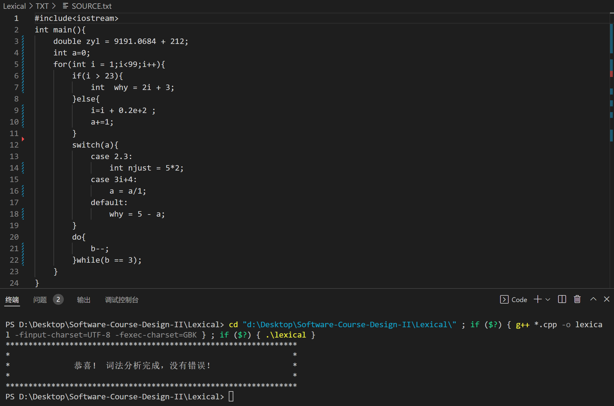

- 修改源程序，检查，能够报出错误信息，指明出错位置

  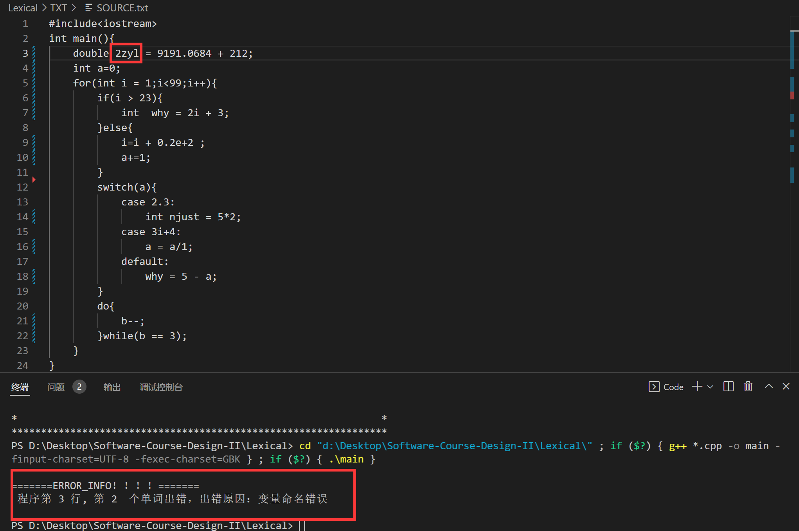


# 2. LR(1)语法分析器

## 2.1 基本原理

- **LR分析法**
  - 根据**状态栈**，和**向右顺序查看**输入串的$k(k≥0)$ 个符号，就可以唯一地确定分析器的动作**是移进还是归约**和用哪个产生式归约，因而能就确定唯一的句柄。
  - LR分析法的归约过程是规范推导的逆过程，所以LR分析过程是一种规范归约的过程
- **LR分析器**
  - 总控程序
  - 分析表：Action-Goto表
  - 分析栈：状态栈、符号栈；
    - 分析器的动作由栈顶状态和当前输入符号来确定
      - 移进：当$S_{j}=GOTO[S_{i},a]$ 成立，将$S_{j}$ 移入到状态栈，将$a$ 移入符号栈
      - 归约：当栈顶形成句柄$\beta$ ，用$\beta$ 归约为相应的非终结符
      - 接受：归约到文法符号栈中只剩下开始符号S，并且输入符号串结束，分析成功
      - 报错：当遇到状态栈顶为某一状态下出现不该遇到的文法符号时报错，无法接受该句子
- **几种LR分析法的区别**
  - **LR(1)**
    - 分析过程不需要向右查看输入符号
    - 不存在**移进-归约** 和 **归约-归约** 冲突，即 R(0)文法分析**不能解决这两种冲突**，所以适用范围最小
  - **SLR(1)**
    - 简单的LR(1)，存在**多余（无效）归约**的情况
    - 不存在归约-归约冲突，**有可能存在移进-归约冲突**，但是如果可以用 follow集解决则是 SLR文法。换句话说，SLR文法分析过程可以解决归约-归约冲突，但是**不一定能解决移进-归约冲突**。用 follow集来处理即出现移进-归约冲突的两条产生式，如果其 follow集相交为空则为 SLR文法，反之不是。
  - **LR(1)**
    - 因为 LR(1)文法的范围比较大，所以文法几乎都是 LR(1)的
- **项目集中的项目种类**
  - 移进项目、待约项目、归约项目、接受项

## 2.2 设计思路

​	读入二型文法产生式文档，识别出所有终结符和非终结符，求相应的First集，构建初始项目集，求其闭包，进行状态转移，得到项目集族，构建Action-Goto表，最后构造分析表。编码过程中，严格分模块进行，每完成一个模块就进行一个模块的测试和校正。大量使用STL极大的简便了繁琐的编码。

## 2.3 文件结构

| 路径                       | 文件说明                |
| -------------------------- | ----------------------- |
| Parser\TXT\ACTION_GOTO.txt | 存放产生的Action-Goto表 |
| Parser\TXT\ANALYSIS.TXT    | 存放分析表              |
| Parser\TXT\GRAMMAR.txt     | 存放文法表              |
| Parser\TXT\ITEMSET.txt     | 存放产生的项目集        |
| Parser\main.cpp            | 主函数                  |
| Parser\parser.cpp          | 函数实现                |
| Parser\parser.h            | 函数和变量声明的头文件  |
| Parser\path.h              | 文件路径定义的头文件    |


## 2.4 语法规则

​	实现基本的运算，赋值，定义变量，if-else，while，do-while，for，switch-case分支语句的判别。抽象的文法映射成程序中的文法规则的逻辑分类如下：

1. 程序框架

   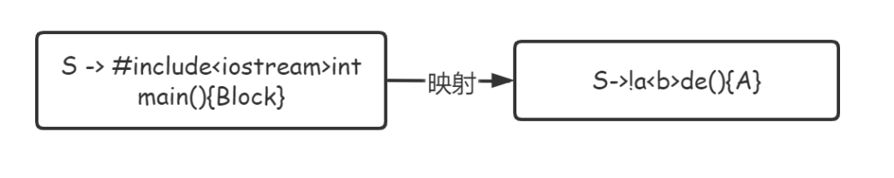

2. 赋值语句

   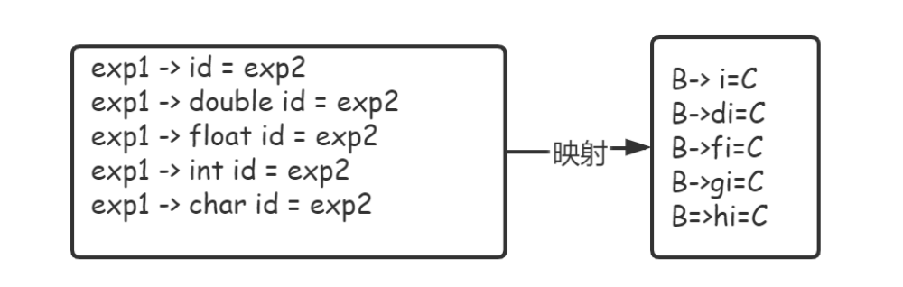

3. 操作语句

   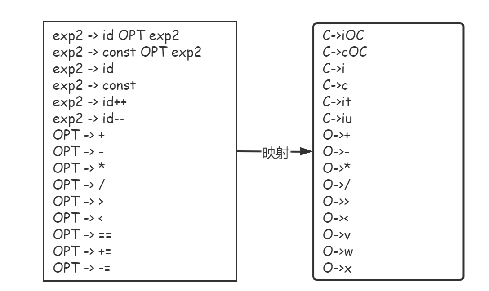

   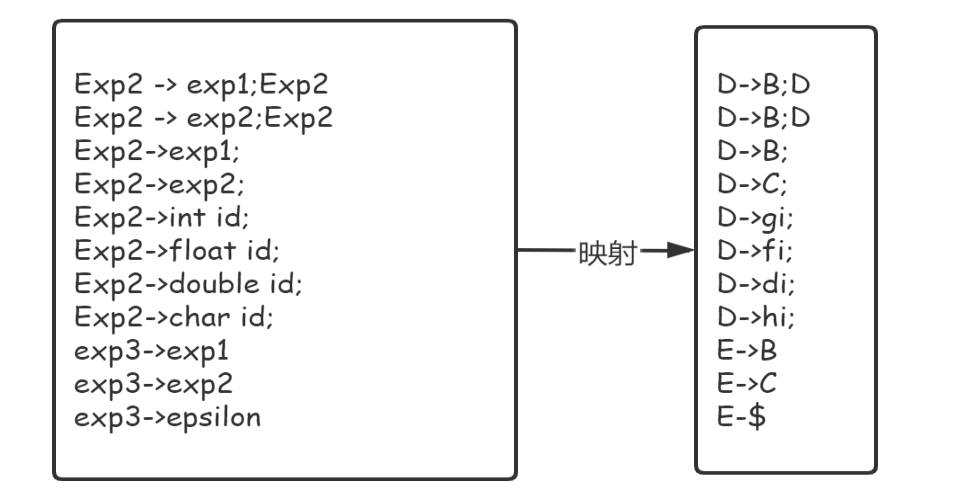

4. 分支语句

   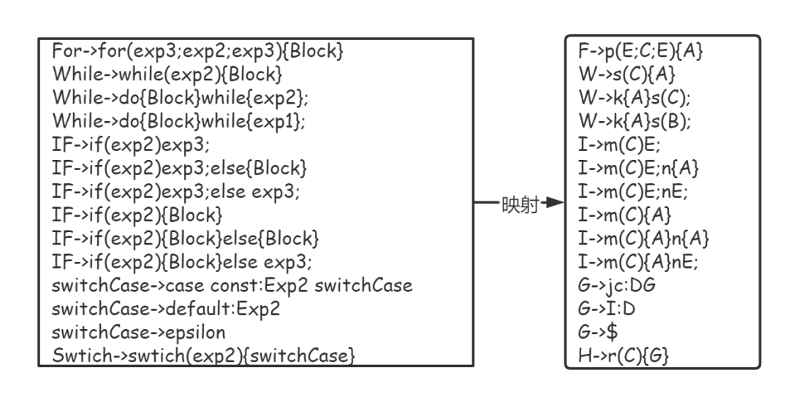

5. 代码块

   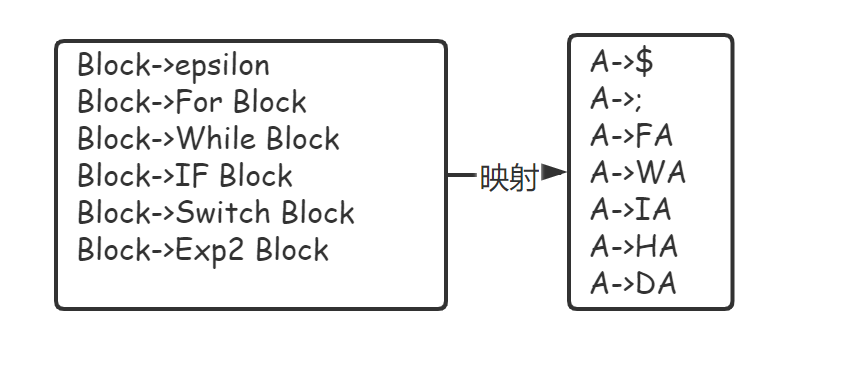

## 2.5 具体实现

### （1）预处理阶段：读取给定的二型文法文件

- 数据结构定义

  - 二型文法产生式的数据结构

    ```cpp
    typedef struct Grammar{
        char left;
        string right;
    }Grammar;
    ```

  - 存放所有产生式的数据结构

    ```cpp
    vector<Grammar> grammar; 
    ```

  - 定义存放token的数据结构，将词法分析器获取的token的**单词映射成一个字符**，存入token字符串中

    ```cpp
     string token;
    ```

  - 定义存放终结符和非终结符的数据结构，VT存放终结符，其中不包括epsilon，epsilon单独处理； VN存放非终结符。

    ```cpp
    set<char> VT;  
    set<char> VN;
    ```

- 算法具体流程如下：

  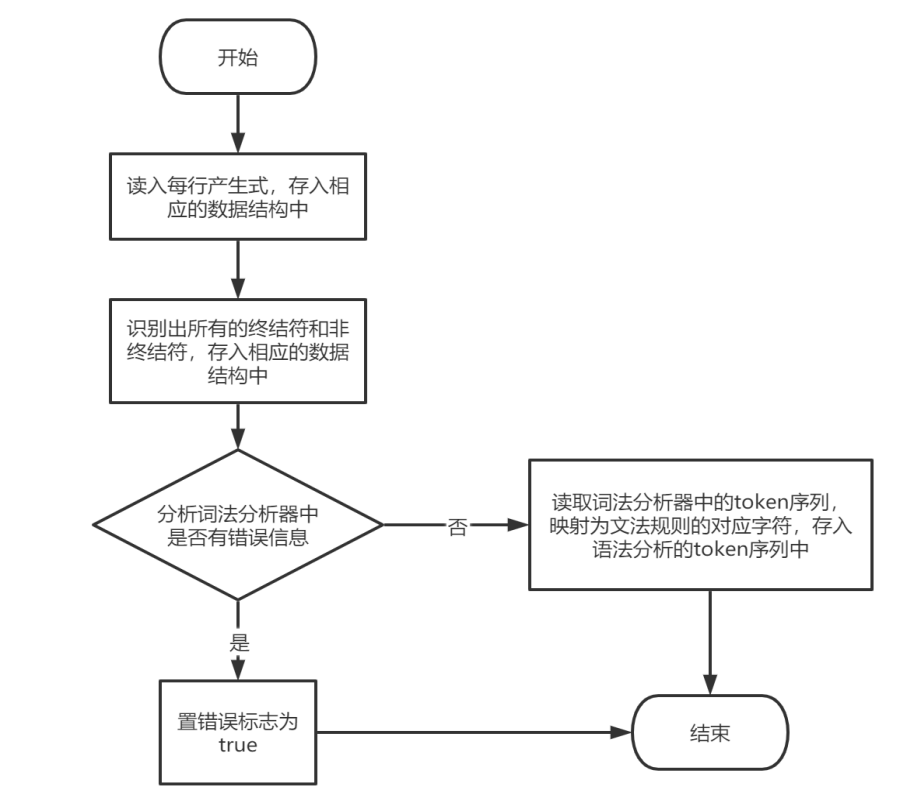


### （2）创建项目集族和Action-Goto表：void create(char left,char right)

- **数据结构定义**

  - LR(1)项目集中的一条项目

    - `left`项目的产生式左边，`right`产生式右边，`position`圆点的位置，规定在`right[position]`的左边，`index` 本项目产生式在文法中的位置索引，`forward`向前搜索符集；

    - 另外重载 `＜ ` 和 ` == `便于后续的一些比较

    ```cpp
    typedef struct Item{
    	char left; 
    	string right;
    	int position = 0; 
    	int index; 
    	set<char> forward; 
    	bool operator<(const struct Item & item) const{...详细见代码...}
    	bool operator==(const struct Item & item) const{...详细见代码...} 
    }Item;
    ```

  - LR(1)项目集族的数据结构

    ```cpp
    set<Item> Itemset[1000];  
    ```

  - Action-Goto表的数据结构

    ​	因为Action和Goto表的**移进项没有本质区别**，只有Action中的移进和归约态有区别。因为终结符和非终结符本代码都只用了一个字符表示，所以采用了char到int的隐式转换作为二维数组的索引，实现了O(1)的查找。。再判断的时候也和256作比较再进行下一步的判断。例如`ActionGoto[state][input]`的值表示栈顶状态为`state`时，遇见字符`input`所要执行的动作。

    ​	**对ActionGoto数组的值的规定**：

    - -1 标识接受动作；
    - -2 标识不存在这个状态转移，即出错动作；
    - 其余：Action表中的移进和归约用是否加256区分：x标识移进动作，x+256表示规约动作

    ```cpp
    int ActionGoto[300][300]; 
    ```

- **算法具体流程**

  ​	left是增广文法的左部非终结符，right是原文法的起始非终结符，用于初始化初始项目集，然后创建所有项目集，得到最终的项目集族，采用的是宽搜的方式，遍历所有终结符和非终结符。

  ​	如果能进行状态转移，那么就核和闭包，扩充项目集。若与原项目集不同则加入到项目集族，增加一条状态转移；若相同则只增加一条状态转移（指向自己），同时填充ActionGoto数组。

  ​	直至项目集族中不再有新项目集出现为止。在建好项目集族后，再来遍历项目集族判断项目集中是否含有归约项，区分和填充ActionGoto数组中的归约项和接受项。

  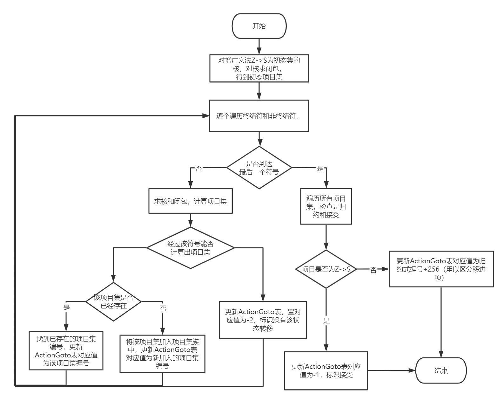

  在构造DFA项目集的过程中，还涉及到以下函数调用

  | 函数作用         | 函数名                                            | 说明                                                         |
  | :--------------- | ------------------------------------------------- | ------------------------------------------------------------ |
  | 求核             | `set<Item> getKernel(char c, set<Item> itemSet)`  | 遍历项目集中的每个项目，与文法进行匹配即可                   |
  | 求闭包           | `set<Item> getClosure(set<Item> itemSet)`         | 通过while循环，循环体内遍历项目集中的每一个项目，若还有能扩充项目则继续迭代，直至项目集中的每一个项目不再能进行扩充。 |
  | 求向前搜索符号集 | `set<char> getForward(char c, set<char> forward)` | 关键在于需要进行c是否为epsilon以及c是否能推出空来判断相应的动作，得到向前搜素符。 |
  | 求First集        | `void getFirstSet()`                              | 通过while循环，循环体内遍历每一个文法，直至每个非终结符的First集不再发生改变就停止迭代，若还有变化则继续迭代。 |

### （3）扫描token序列进行语法分析：void scanSourceToken(string token_str) 

​	首先检查词法分析无误，然后再进行语法分析，依据Action-Goto表依次对输入的token进行分析，根据当前的项目集（即DFA状态）和当前的token找Action-Goto表中的对应项，根据表中对应的值，判断是移进还是归约还是acc还是报错。如果是移进则更新当前状态，同时将状态和token入栈；如果是归约，则符号栈和状态栈依据归约文法进行退栈和入栈，同时根据最新的状态和token进行移进。直至acc或者检测到语法出错，则迭代结束。具体流程图如下：

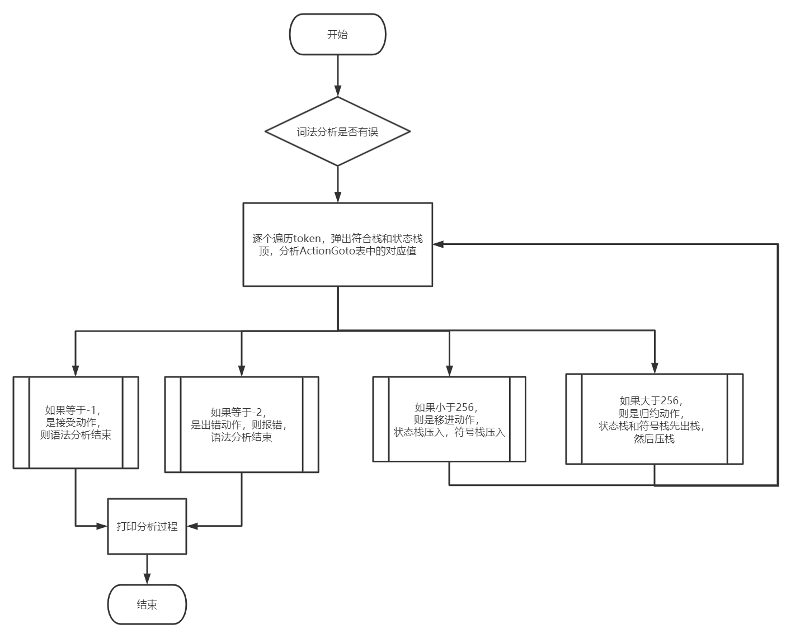


## 2.6 实例分析

- 输入正确源程序，语法分析成功，无误。

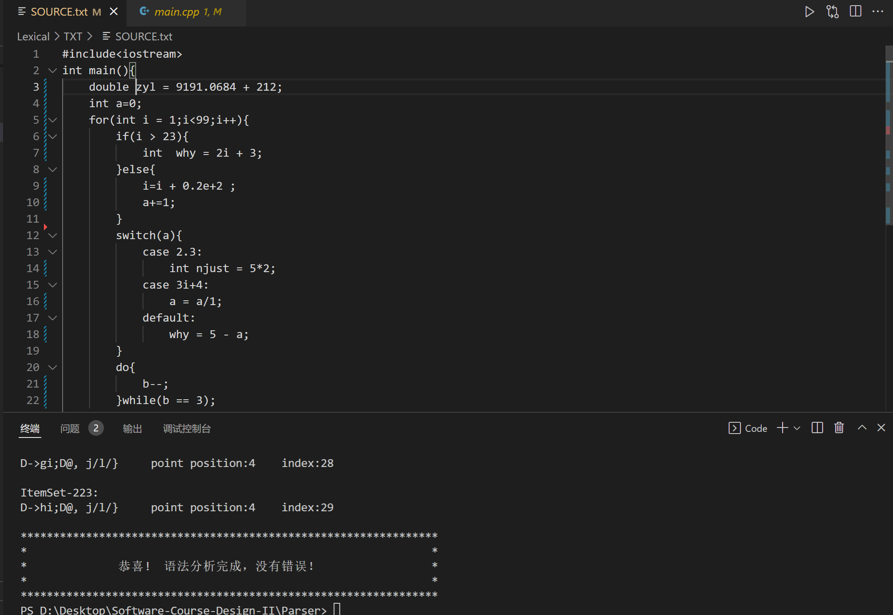

- 修改源程序，检查，能够报出错误信息，指明出错位置

  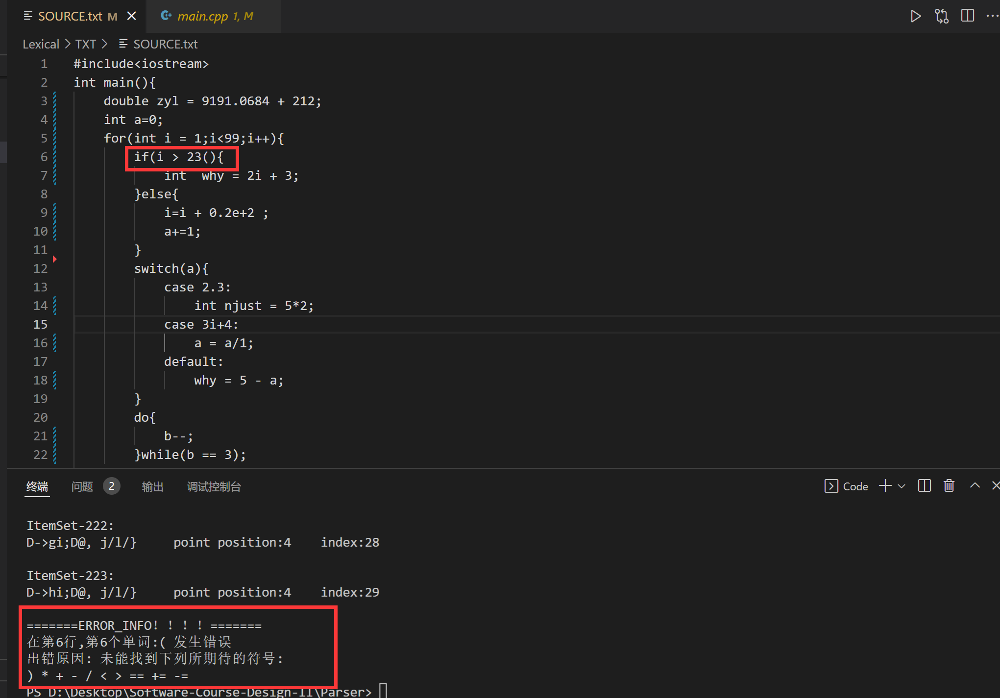

  

# 3. 运行环境说明

- 操作系统：Windows 10

- 运行环境：Visual Studio Code

- 说明：编译链接Lexical或者Parser中的各个.cpp文件，然后运行main.cpp即可，Visual Studio Code环境下推荐CodeRunner插件一键运行；若更改源程序进行语法分析器的测试，请先运行词法分析器得到相应的token，再进行语法分析

  

# 3. 课设总结

​	本次课设花了将近两周的时间，首先由于是上学期学的编译原理，时间一长难免有些遗忘，所以在写代码前提前粗略地复习了一下之前学过的知识。在写代码过程中的同时，将理论知识转换成实际代码，也加深了我对编译原理课程所学知识的理解，也对我的代码能力有一定的提高。在写代码的过程中，感受到了选择一项好的数据结构的重要性，尤其是对C++中STL的实际应用，各种各样的数据结构让我体会到了STL的简便性。

​	在本次课设中，也遇到了一些磕磕碰碰，比如在进行语法分析器的设计，因为之前用的是书上的例子，导致之前开的保存项目集族的全局变量并没有很大，结果在代入自己的文法时，异常中断，最后通过开一大数组解决问题。还比如，在进行set的遍历时，删除了容器的部分元素，导致当前迭代器失效，通过预先获取下一步的迭代器，再删除现有的迭代器解决问题。

​	但是通过此次课程设计，让我体会到代码的模块化能够大大地节省编码过程中的调试时间，使代码逻辑层次更加清晰的好处。在编码过程中，将各个算法所用到的函数一个个写好，分阶段测试函数，整合算法，边写边检查和调试，就能够保证最终整合代码运行时报错模块数量最少。上学期虽然编译原理学得不错，但是转换成具体可用的程序来说，仍是有点陌生，但通过手动实现词法分析器和语法分析器，让我加深了对编译原理的理解和运用，总体来说收获颇丰。